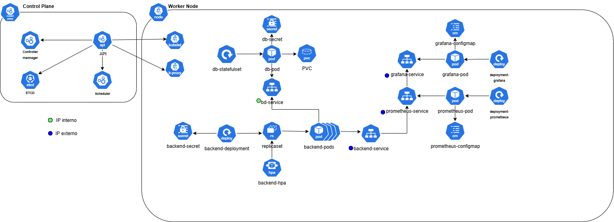

# Fastfood API 🍔


Projeto desenvolvido como parte do Tech Challenge da Pós-Tech em Arquitetura de Software da FIAP (Grupo 202).

## 🧩 Contexto

O desafio propõe a criação de um sistema de autoatendimento para uma lanchonete em expansão, resolvendo problemas de organização de pedidos, agilidade no atendimento e gestão de produtos/clientes.

## ⚙️ Funcionalidades

- Cadastro e identificação de clientes via CPF
- Criação, edição e exclusão de produtos e categorias fixas (Lanche, Acompanhamento, Bebida, Sobremesa)
- Montagem de pedido por etapas opcionais
- Integração com pagamento fictício via QRCode do Mercado Pago
- Acompanhamento do pedido em tempo real (Recebido, Em preparação, Pronto, Finalizado)
- Painel administrativo para acompanhamento de pedidos e gestão de produtos/clientes
- APIs RESTful documentadas via Swagger
- Observabilidade e métricas com Prometheus, Grafana, Loki e Promtail

## 🧱 Arquitetura

- Java 17
- Spring Boot 3.4.5
- PostgreSQL
- Docker + Docker Compose
- Kubernetes (Minikube)
- Prometheus + Grafana + Loki + Promtail
- Flyway para versionamento de banco
- Micrometer para métricas
- JaCoCo para cobertura de testes
- Checkstyle para análise estática de código

## 📦 Como executar localmente

### Pré-requisitos

- Docker e Docker Compose
- Minikube
- Maven 3.8.6 ou superior
- Java 17
- Gitbash
- IDE de sua preferência (IntelliJ, Eclipse, etc.)
- Conta no Mercado Pago (opcional, para testes de pagamento)

### Desenho de Infraestrutura


#### Serviços
- fastfood-app (Deployment)
  - API Java 17
  - Exposta via app-service (NodePort 8080).
- fastfood-app (HPA)
  - Escalonamento automático da API por métricas de CPU.
  - Máximo de 5 réplicas
- fastfood-app (Secret)
  - Protegem credenciais sensíveis da aplicação e do banco.
  - Criptografia em base 64.
- Banco de Dados (Postgres - Deployment)
  - API conecta ao banco via bd-service.
  - Credenciais armazenadas em Secret.
  - Persistência de dados com volume persistente (PVC).
- Prometheus (Deployment): Coleta métricas da API para monitoramento
- Grafana (Deployment): Visualização de métricas e dashboards.
- ConfigMaps: Configurações para Prometheus, Grafana.

#### Requisitos de negócio
- Alta disponibilidade e escalabilidade: 
  - Garantida pelo HPA e pelo uso de replica sets.
- Monitoramento e observabilidade: Métricas e logs centralizados via Prometheus e Grafana.
  - 🚧 Loki e Promtail - Próxima fase de implementação. 🚧
- Segurança: Uso de Secrets para variáveis sensíveis.
- Persistência de dados: Banco de dados Postgres com volume persistente.

### Passos

```bash
# Clonagem do projeto
$ git clone https://github.com/Grupo-202-FIAP/api.git
$ cd api/infra

# Execução do script de inicialização do Kubernetes
$ ./deploy.sh

# Acessar dashboard do minikube
$ minikube dashboard

# Acessar os serviços da aplicação, Prometheus e Grafana
$ minikube service app-service
$ minikube service prometheus-service
$ minikube service grafana-nodeport-svc

# Acessar o Swagger da aplicação
http://<127.0.0.1>:<porta_do_servico_app_service>/swagger-ui/index.html

```

## 🌐 Serviços disponíveis localmente

- [Aplicação](http://localhost:8080)
- **Banco de Dados**: `localhost:5432`
    - Usuário: `postgres`
    - Senha: `postgres`
- [Prometheus](http://localhost:9090)
- [Grafana](http://localhost:3001) (senha: `admin`)
- [Loki](http://localhost:3100)

## 📑 Documentação da API

Swagger disponível após subir a aplicação:

🔗 [http://localhost:8080/swagger-ui/index.html](http://localhost:8080/swagger-ui/index.html)

Collection do Insomnia para testes da API: [Insomnia Collection](local/fastfood-collection.yaml)

## 🧪 Testes e Qualidade

- Para rodar os testes e gerar cobertura com JaCoCo:

```bash
mvn clean test jacoco:report
```
- Cobertura de testes com JaCoCo (relatórios em `target/site/jacoco`)
- Análise de estilo de código com `checkstyle.xml`

## 🔄 Atualizações automáticas

Este projeto utiliza **Dependabot** para manter as dependências Maven e Docker sempre atualizadas. O bot verifica semanalmente por novas versões e cria Pull Requests automaticamente.

## 🧠 Documentação da Fase 1

A documentação completa com Event Storming, Diagrama de Contexto, Fluxos e Modelos Ubiquamente nomeados está disponível em **[MIRO](https://miro.com/app/board/uXjVIGITNZs=/)**

## 📹 Demonstração Fase 1

Vídeo com a arquitetura e execução via Docker Compose disponível em: **[VÍDEO](https://www.youtube.com/watch?v=O0kyaD-p7C8&ab_channel=Fernandeeess)**

## 📹 Demonstração Fase 2

Vídeo com a arquitetura e execução via Kubernetes disponível em: **[VÍDEO]()**


